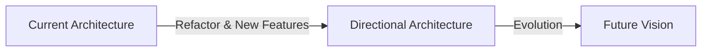

# Master Architecture Document

> ⚠️ **CRITICAL**: This document is the "Source of Truth" for the `architectural-review` skill.

## 1. The Dual-Architecture Model

We manage two states simultaneously. Every PR must move us from **Current** to **Directional**.



### 1.1 Current State (Where We Are)
*Describes the actual production state today.*

#### Tech Stack
- **Frontend**: [e.g., React, Next.js, Tailwind]
- **Backend**: [e.g., Node.js, Express, PostgreSQL]
- **Infrastructure**: [e.g., AWS, Vercel, Supabase]

#### Current Patterns (The Reality)
- **Styling**: Mixed (CSS Modules + Tailwind + Inline Styles)
- **State**: Redux (Legacy) + React Context
- **API**: REST (Main) + GraphQL (Experimental)

#### Technical Debt Inventory
| Severity | Description | Location | Remediation Plan |
|----------|-------------|----------|------------------|
| **High** | Inline styles in legacy components | `src/components/legacy` | Migrate to Design Tokens |
| **Medium** | Direct DB access in controllers | `src/api/controllers` | Refactor to Repository Pattern |
| **Low** | Prop drilling in User Profile | `src/features/profile` | Move to Context/Zustand |

---

## 2. Directional State (Where We Are Going)
*Describes the target architecture we enforce in Code Reviews.*

### 2.1 The "North Star" Qualities
Every change must maintain or improve:
1.  **ROBUSTNESS**: Handles edge cases; no silent failures.
2.  **RESILIENCE**: Recovers from errors; degrades gracefully.
3.  **EFFECTIVENESS**: Minimal complexity for maximum value.
4.  **SCALABILITY**: Loosely coupled; ready for growth.

### 2.2 Target Patterns (The Goal)

#### Hexagonal Architecture (Backend)
We strictly enforce a dependency rule: **Dependencies point INWARD.**

```
[Infrastructure (DB/Web)] -> [Adapters] -> [Application/Use Cases] -> [Domain]
```
*   **Domain** depends on NOTHING.
*   **Infrastructure** depends on Domain.
*   **NEVER** import Infrastructure code into the Domain.

#### Design System (Frontend)
- **Zero Inline Styles**: All styling must use tokens from `@theme`.
- **Composition**: Use slots/children over complex configuration props.
- **Strict Boundaries**: Logic belongs in Hooks/Stores; View belongs in Components.

### 2.3 Migration Goals (Next 3 Months)
1.  **Eliminate Inline Styles**: 100% adoption of Design Tokens.
2.  **Repository Pattern**: 100% of DB access goes through defined Repositories.
3.  **Test Coverage**: Increase core business logic coverage to 80%.

---

## 3. Forbidden Patterns (The Anti-Pattern Registry)

| Pattern | Why it is Forbidden | Allowed Alternative |
|---------|---------------------|---------------------|
| **Inline CSS** | Hard to maintain, impossible to theme | `classNames` with Design Tokens |
| **God Components** | Hard to test/reuse | Composition / Atomic Components |
| **Direct DB Calls** | Tight coupling, hard to mock | Repository Interfaces |
| **Any/Unknown Types**| Defeats TypeScript safety | Strict Interfaces / Generics |
| **Magic Numbers** | Obscures meaning | Named Constants |

---

## 4. Component & Service Registry

*See full inventory at:*
- Components: `@ref(CB-UI-COMPONENTS-001)` or `devdocs/ui/components.md`
- Services: `@ref(CB-ARCH-COMPONENTS-001)` or `devdocs/architecture/components.md`
