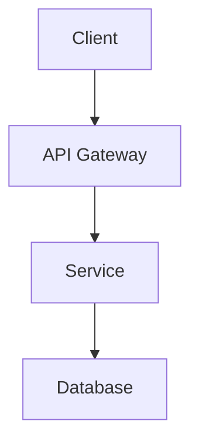

# Documentation Standard

[!FIXED!]
## Purpose

Consistent documentation structure enables both humans and AI agents to navigate, understand, and maintain project knowledge. This standard defines how documentation should be organized and formatted.

**Key Principle**: Use `devdocs/` for development documentation, not `docs/` (which is typically for user-facing documentation).
[!FIXED!]

---

=== DIRECTORY STRUCTURE ===
<!-- AI:STRUCTURE:START -->

### Root Organization

```
devdocs/
├── _devdocs-index.md         # Master index
├── architecture/             # System design
│   ├── index.md
│   ├── architecture-overview.md
│   ├── components.md
│   ├── integration-points-v1.md
│   └── deployment-architecture-v1.md
├── data/                     # Database design
│   ├── index.md
│   ├── schema-design.md
│   ├── migrations.md
│   ├── seed-data.md
│   └── relationships.md
├── business/                 # Business requirements
│   ├── index.md
│   ├── goals.md
│   ├── requirements.md
│   ├── constraints.md
│   └── scope.md
└── ui/                       # UI documentation
    ├── index.md
    ├── design-system.md
    ├── components.md
    ├── layouts.md
    ├── animations.md
    └── user-flows.md
```

### Category Guidelines

| Category | Purpose | Examples |
|----------|---------|----------|
| `architecture/` | System design, components, deployment | architecture-overview.md, components.md |
| `data/` | Database schema, migrations, relationships | schema-design.md, migrations.md |
| `business/` | Goals, requirements, constraints | goals.md, requirements.md |
| `ui/` | Design system, components, flows | design-system.md, components.md |

<!-- AI:STRUCTURE:END -->

---

=== FILE NAMING ===
<!-- AI:NAMING:START -->

### Naming Convention

- All lowercase
- Use hyphens for spaces
- Include version numbers for versioned documents
- Format: `category-description[-vN].md`

**Examples:**
```
architecture-system-overview.md
data-schema-v1.md
ui-components.md
integration-points-v1.md
```

### Versioning

Include version suffix when document represents a specific version:
- `deployment-architecture-v1.md` - Version 1 of deployment architecture
- `schema-design-v2.md` - Version 2 of schema design

Omit version for living documents that are continuously updated:
- `architecture-overview.md` - Always current
- `components.md` - Always current

<!-- AI:NAMING:END -->

---

=== DOCUMENT FORMAT ===
<!-- AI:FORMAT:START -->

### Markdown Structure

Use structured headers with clear hierarchy:

```markdown
## Main Section

### Subsection

#### Detail Level

##### Fine Detail
```

### Machine-Readable Elements

**Section Markers** (for AI parsing):
```markdown
=== SECTION NAME ===
<!-- AI:SECTION:START -->

Content here

<!-- AI:SECTION:END -->
```

**Cross-References**:
```markdown
See @ref(CB-STD-COMMITS-001) for commit format
See @skill(git-workflow) for Git procedures
See @agent(code-chef) for code generation
```

**Status Indicators**:
```markdown
[!FIXED!] - Content that should not be modified
[?DYNAMIC?] - Content that requires regular updates
```

### Frontmatter (Optional)

For documents that need metadata:

```yaml
---
document_name: "example.md"
location: "devdocs/architecture/example.md"
version: "1.0.0"
date_created: "2026-01-19"
status: "active"
---
```

<!-- AI:FORMAT:END -->

---

=== INDEX FILES ===
<!-- AI:INDEXES:START -->

### Purpose

Every documentation category MUST have an `index.md` that:
- Lists all documents in the category
- Provides brief descriptions
- Shows document status
- Links to related categories

### Index Template

```markdown
# Category Name

## Overview

Brief description of this category's purpose.

## Documents

| Document | Purpose | Status |
|----------|---------|--------|
| document-name.md | Brief description | active |
| another-doc.md | Brief description | draft |

## Related

- See `../other-category/` for related information
- See @ref(CB-STD-XXX-001) for standards
```

<!-- AI:INDEXES:END -->

---

=== CONTENT GUIDELINES ===
<!-- AI:CONTENT:START -->

### Writing Style

- **Be concise**: Get to the point quickly
- **Be specific**: Avoid vague language
- **Be actionable**: Provide clear next steps
- **Be current**: Update as project evolves

### Code Examples

Always include:
- Language identifier in code blocks
- Comments explaining non-obvious logic
- Complete, runnable examples when possible

```typescript
// Good: Complete, commented example
interface User {
  id: string;
  email: string;
  // ISO 8601 timestamp
  createdAt: string;
}
```

### Diagrams

Use Mermaid for diagrams when possible:



### Tables

Use tables for structured comparisons:

| Option | Pros | Cons | Recommendation |
|--------|------|------|----------------|
| A | Fast | Complex | Use for X |
| B | Simple | Slow | Use for Y |

<!-- AI:CONTENT:END -->

---

=== MAINTENANCE ===
<!-- AI:MAINTENANCE:START -->

### Update Triggers

Update documentation when:
- Architecture changes
- New features added
- APIs modified
- Data models change
- Deployment process changes

### Deprecation

When deprecating documentation:
1. Add `status: deprecated` to frontmatter
2. Add deprecation notice at top
3. Link to replacement document
4. Keep for historical reference

```markdown
> **DEPRECATED**: This document is deprecated as of 2026-01-19.
> See [new-document.md](new-document.md) for current information.
```

### Review Cycle

- **Architecture docs**: Review quarterly
- **Business docs**: Review when requirements change
- **Data docs**: Review with each schema change
- **UI docs**: Review with design system updates

<!-- AI:MAINTENANCE:END -->

---

=== ANTI-PATTERNS ===
<!-- AI:ANTIPATTERNS:START -->

| Anti-Pattern | Why Bad | Alternative |
|--------------|---------|-------------|
| Mixing `docs/` and `devdocs/` | Confusing structure | Use `devdocs/` for dev docs |
| No index files | Hard to navigate | Create index.md in each category |
| Stale documentation | Misleading | Update with code changes |
| Vague descriptions | Not actionable | Be specific and concrete |
| No version tracking | Can't track evolution | Version significant changes |

<!-- AI:ANTIPATTERNS:END -->

---

=== RELATED DOCUMENTS ===
<!-- AI:RELATED:START -->

| Document | Codebook ID | Relationship |
|----------|-------------|--------------|
| _devdocs-index.md | CB-DEVDOCS-INDEX | Master documentation index |
| preamble.template.md | CB-TPL-PREAMBLE-001 | Document frontmatter template |

<!-- AI:RELATED:END -->
### Subsection
#### Component
```

2. Include YAML frontmatter for AI parsing[3]:
```markdown
---
title: Component Documentation
version: 1.0
last_updated: 2025-02-24
ai_context: This document describes UI components
---
```

3. Use tables for structured data:
```markdown
| Component | Purpose | Dependencies |
|-----------|---------|--------------|
| Auth      | Login   | JWT         |
```

## Documentation Maintenance

1. Implement automated review cycles[8]:
- Set up automated reminders every 3 months
- Use git hooks to enforce documentation updates with code changes
- Include documentation review in PR checklists

2. Version Control Integration[7]:
- Store documentation in the same repository as code
- Use branch protection rules to ensure documentation updates
- Implement markdown linting in CI/CD pipeline

3. AI-Specific Sections[3]:
- Include clear context boundaries
- Define relationships between components
- Use consistent terminology across documents

## Best Practices for AI Readability

1. Clear Section Demarcation:
```markdown

Content specifically formatted for AI parsing

```

2. Component Relationships:
```markdown

- Component A depends on Component B
- Component B requires Service C

```

3. Implementation Constraints:
```markdown

- Memory limit: 512MB
- Response time: 
```

## Documentation Update Process

1. Automated Triggers[9]:
- Documentation review required for any major version change
- Automated staleness checks
- Integration with issue tracking system

2. Validation Process[12]:
- Automated markdown validation
- Link checking
- Terminology consistency verification

I'll create an AI-optimized template system for documentation that's both human-readable and machine-parseable.

## Master Template Structure

Every document will follow this base structure:

```markdown
---
# Document Metadata (YAML Frontmatter)
title: ""
file_name: ""
version: ""
last_updated: ""
category: ""
related_docs: 
  - ""
  - ""
ai_parser_instructions: |
  This document uses the following markers:
  === SECTION START === : Indicates a main section
  --- SUBSECTION --- : Indicates a subsection
  > : Placeholder to be filled
  [!FIXED!] : Content that should not be modified
  [?DYNAMIC?] : Content that should be updated regularly
---

[!FIXED!]
# Document Guide
This document follows the standard documentation template v1.0.
All sections marked with [!FIXED!] must not be modified.
Content marked with [?DYNAMIC?] should be regularly updated.
Replace > with actual content.
[!FIXED!]

=== TABLE OF CONTENTS ===
[?DYNAMIC?]
1. >
[?DYNAMIC?]

=== PURPOSE ===
[?DYNAMIC?]
>
[?DYNAMIC?]

=== DOCUMENT RELATIONSHIPS ===
[?DYNAMIC?]
- Parent: >
- Children: >
- Dependencies: >
[?DYNAMIC?]
```

## Architecture Document Template

```markdown
=== SYSTEM OVERVIEW ===
[?DYNAMIC?]
>
[?DYNAMIC?]

--- COMPONENTS ---
[?DYNAMIC?]
| Component | Purpose | Dependencies |
|-----------|---------|--------------|
| > | > | > |
[?DYNAMIC?]

--- INTERFACES ---
[?DYNAMIC?]
| Interface | Type | Protocol |
|-----------|------|----------|
| > | > | > |
[?DYNAMIC?]
```

## Data Schema Document Template

```markdown
=== DATABASE OVERVIEW ===
[!FIXED!]
This section describes the database architecture and schema.
[!FIXED!]

--- ENTITIES ---
[?DYNAMIC?]
| Entity | Description | Primary Key |
|--------|-------------|-------------|
| > | > | > |
[?DYNAMIC?]

--- RELATIONSHIPS ---
[?DYNAMIC?]
| Entity 1 | Relationship | Entity 2 |
|----------|--------------|----------|
| > | > | > |
[?DYNAMIC?]
```

## UI Documentation Template

```markdown
=== DESIGN SYSTEM ===
[?DYNAMIC?]
>
[?DYNAMIC?]

--- COMPONENTS ---
[?DYNAMIC?]

Component: >
Usage: >
Props: >

[?DYNAMIC?]

--- LAYOUTS ---
[?DYNAMIC?]

Layout: >
Breakpoints: >
Grid: >

[?DYNAMIC?]
```

## Business Requirements Template

```markdown
=== BUSINESS GOALS ===
[?DYNAMIC?]

1. >
2. >

[?DYNAMIC?]

--- SUCCESS METRICS ---
[?DYNAMIC?]
| Metric | Target | Measurement |
|--------|--------|-------------|
| > | > | > |
[?DYNAMIC?]

--- CONSTRAINTS ---
[?DYNAMIC?]

- >
- >

[?DYNAMIC?]
```

## AI Parser Guidelines

1. Section Markers:
```markdown

Content

```

2. Relationship Definitions:
```markdown

{
  "depends_on": ["doc1", "doc2"],
  "implements": ["req1", "req2"],
  "affects": ["component1", "component2"]
}

```

3. Version Control:
```markdown

{
  "version": "1.0",
  "changes": [
    {"date": "2025-02-24", "type": "update", "description": "Updated component X"}
  ]
}

```

## Maintenance Guidelines

1. Document Updates:
- Use git hooks to trigger documentation validation
- Implement automated version incrementing
- Include AI-readable changelog entries

2. Validation Rules:
- All sections must be properly marked with start/end tags
- YAML frontmatter must be complete
- Relationships must be valid and reciprocal

3. AI Integration Points:
- Include machine-readable metadata for each section
- Maintain consistent terminology across documents
- Use structured data formats for complex information

This template system ensures both human readability and machine parseability while maintaining clear boundaries between fixed and dynamic content[1][3][13]. The structured format allows AI agents to easily identify relationships between components and maintain context across multiple documents[11][12].
